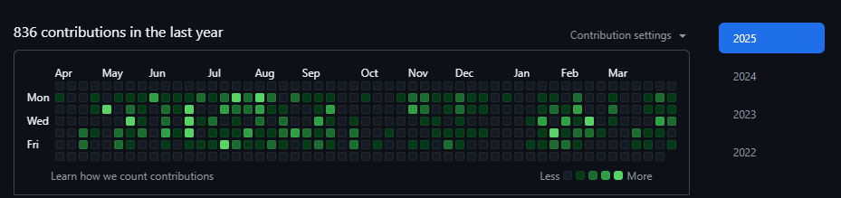
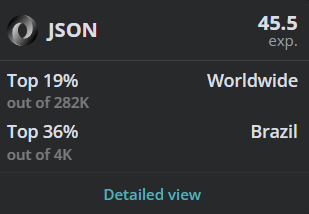

<link rel="stylesheet" href="https://cdn.jsdelivr.net/gh/devicons/devicon@latest/devicon.min.css">

### Eduardo Passos

##

  

In software development, I found a way to exercise my passion for helping people. Seeing the satisfaction after completing a task makes me feel fulfilled. Currently, I have been interested in and learning about developing websites, apps, and games.

I’m currently working on <a href="https://tseautomacao.com.br" target="_blank">TSE Energia e Automação</a>. At the company where I work, I have another Git account, and here is the contribution history from the past year.

> Last update on April 4
> 

 

<i class="android-original"></i>

> Language Overview

  
  

   

  
  
  
   

  
  
  
   

  
  
  
   
  
  
  

> Technologies

  
  
  

    

  
  
  

    

  

